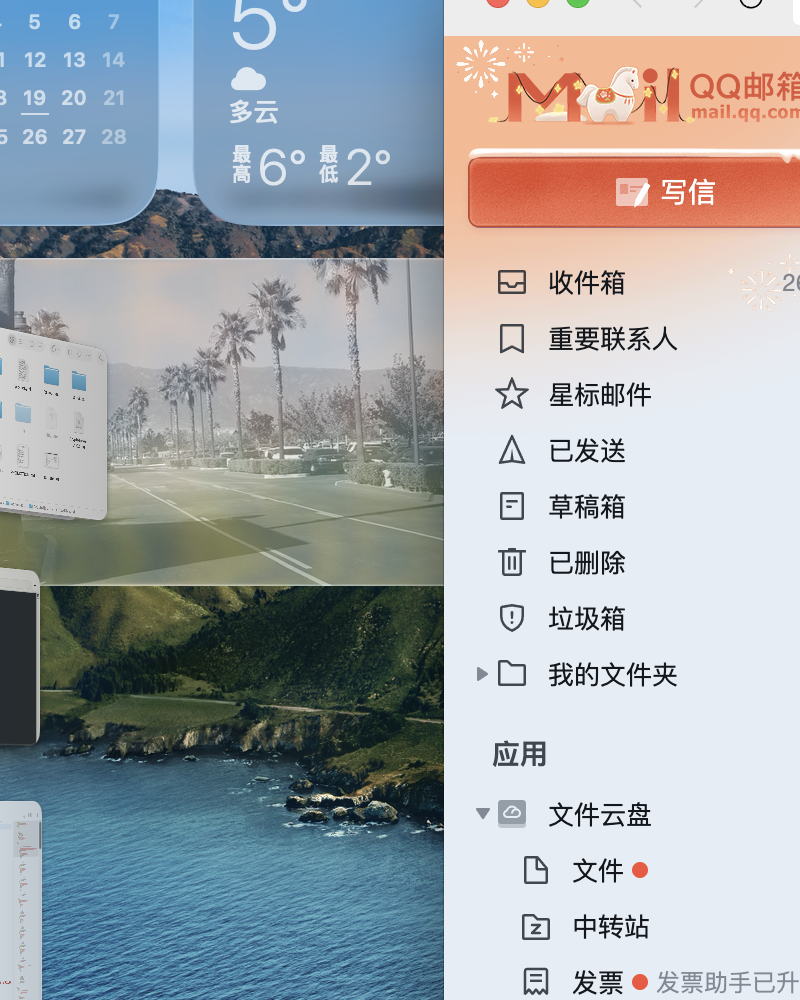

# 🚀 CryptoTicker - 你的加密货币实时行情助手

一款专为 macOS 设计的精美加密货币行情悬浮面板，让 BTC、ETH、SOL 价格随时随地一目了然！

---

## ✨ 功能亮点

### 🎨 玻璃拟态设计
- 透明悬浮窗口，完美融入 macOS 界面
- 优雅的暗色主题，绿色/红色涨跌幅一目了然

### 📊 实时价格
- 来自 Coinbase 官方 API，数据准确可靠
- BTC、ETH、SOL 三大主流币种
- 10秒自动刷新，随时掌握最新行情

### 📈 交互式图表
- 支持 7 种时间范围：1分钟、5分钟、15分钟、1小时、4小时、1天、1月
- Swift Charts 渲染，流畅无比
- 支持缩放查看细节

### 📱 紧凑/展开双模式
- **紧凑模式**：悬浮桌面侧边，显示实时价格曲线
- **展开模式**：悬停展开，查看完整图表和更多详情
- 鼠标悬停即切换，体验丝滑

---

## 📥 下载安装

**方式一：直接下载**
👉 [下载 CryptoTicker v1.0 DMG](https://github.com/remmus31/CryptoTicker/releases)

**方式二：源码编译**
```bash
git clone https://github.com/remmus31/CryptoTicker.git
cd CryptoTicker
open CryptoTicker.xcodeproj
```

---

## 🛠 技术栈

- **SwiftUI** + **Swift Charts** - 现代化 UI 框架
- **NSPanel** - 原生 macOS 悬浮窗口
- **Coinbase API** - 实时价格数据
- **MVVM** - 清晰架构

---

## 📱 实际效果



---

## ⭐ 支持我们

如果你喜欢这个项目，欢迎：
- ⭐ Star 项目
- 📢 推荐给朋友
- 🐛 提交 Bug/建议

**GitHub**: https://github.com/remmus31/CryptoTicker

---

Made with 💙 for crypto enthusiasts
